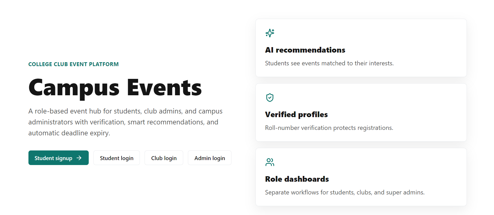
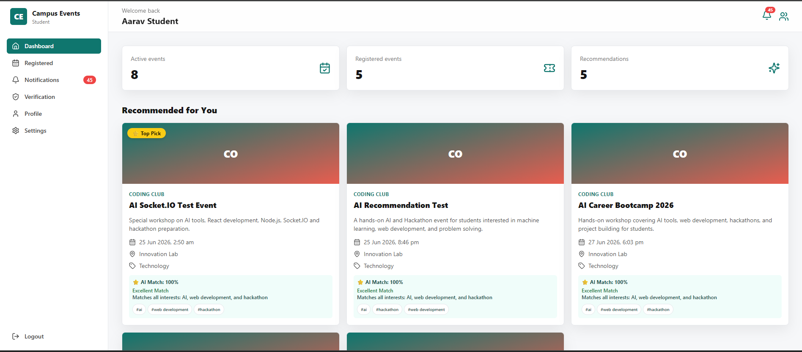
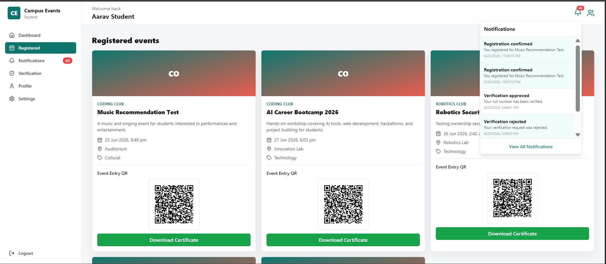
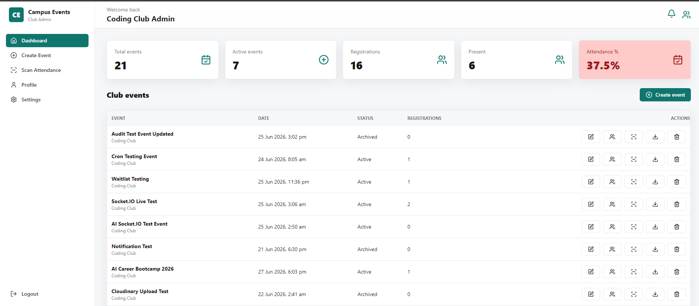
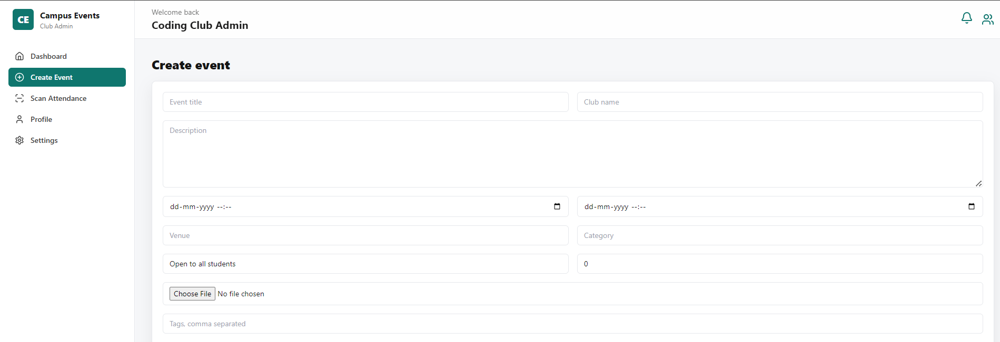
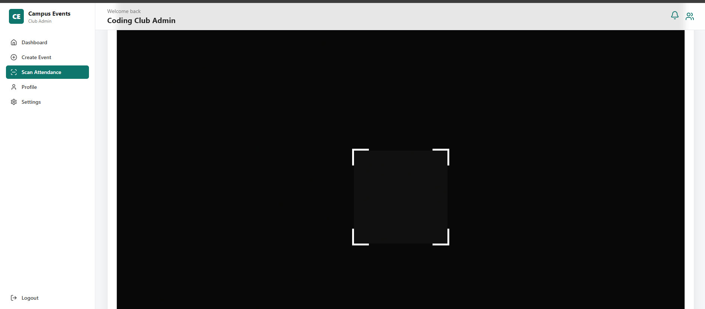
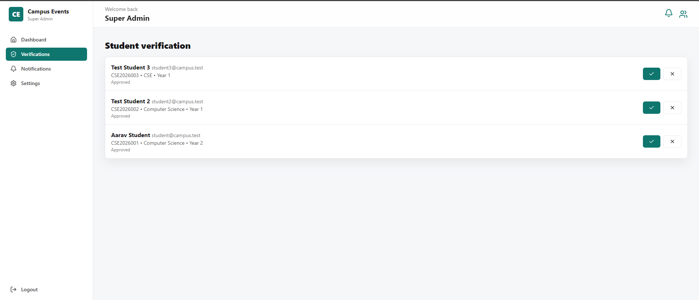
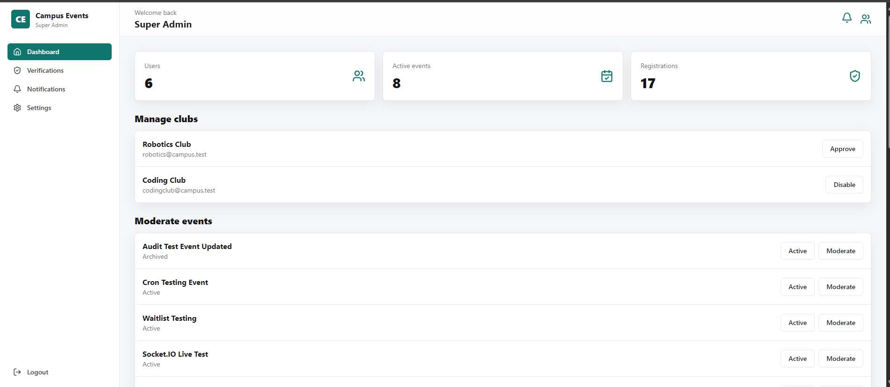
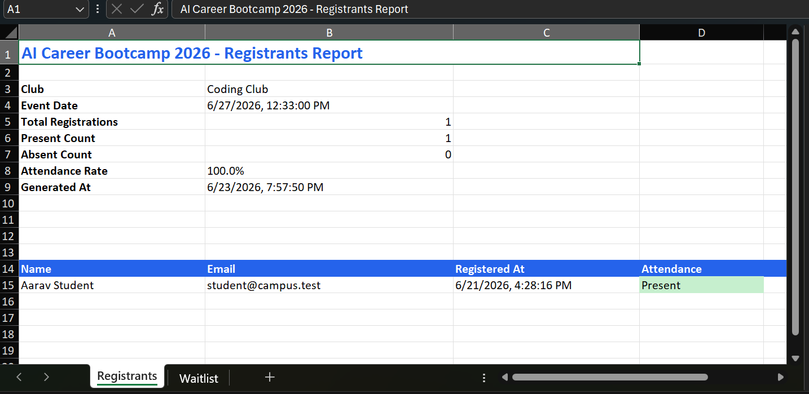
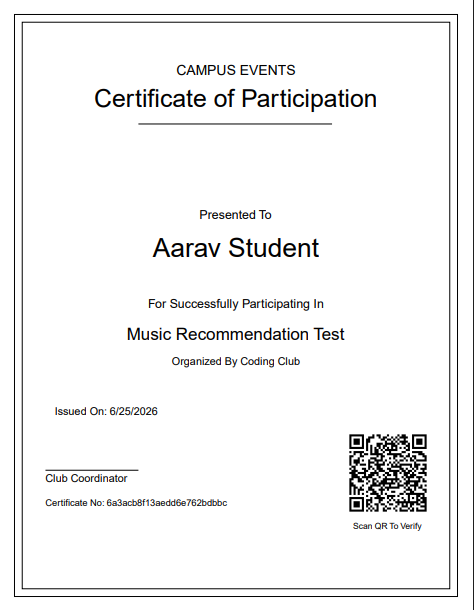

# CampusOS – Smart Campus Event Management Platform

A full-stack MERN application designed to streamline campus event management for students, clubs, and administrators.



CampusOS provides event discovery, registrations, waitlist management, QR-based attendance tracking, certificate generation, AI-powered recommendations, real-time updates, and automated email reminders in a single platform.

---

## Live Demo

### Frontend

https://campus-os-1.onrender.com

### Backend Health Check

https://campus-os-s4s2.onrender.com/api/health

---

## Problem Statement

Managing college events manually often leads to:

* Inefficient registration management
* Attendance fraud
* Poor event discovery
* Lack of communication with participants
* Manual certificate distribution
* No centralized event platform

CampusOS solves these challenges through automation, AI-powered recommendations, QR verification, and real-time event management.

---

## Screenshots

### Landing Page


---

### Student Dashboard



---

### Student Registered Events



---

### Club Dashboard



---

### Event Creation



---

### QR Attendance Scanner



---

### Admin Verification Dashboard



---

### Admin Dashboard



---

### Excel Export



---

### Participation Certificate



---

## Project Highlights

- 3 User Roles (Student, Club Admin, Super Admin)
- QR-Based Attendance System
- Real-Time Updates Using Socket.IO
- AI-Powered Event Recommendations
- PDF Certificate Generation & Verification
- Excel Export Reporting
- Automated Email Reminder System
- Production Deployment on Render
---

## Features

### Authentication & Authorization

* JWT Authentication
* Secure Password Hashing
* Protected Routes
* Role-Based Access Control (RBAC)

Roles:

* Student
* Club Admin
* Super Admin

---

### Event Management

* Create Events
* Edit Events
* Archive Events
* Event Categories
* Registration Deadlines
* Event Status Management

---

### Student Features

* Browse Upcoming Events
* Register for Events
* View Registered Events
* Personalized Dashboard
* Event Notifications
* Download Participation Certificates

---

### Smart Waitlist System

* Automatic Waitlist Creation
* Auto-Promotion When Seats Become Available
* Registration Status Tracking
* Real-Time Seat Management

---

### AI-Powered Recommendations

* Personalized Event Recommendations
* Interest-Based Matching
* Groq AI Integration
* Cached Recommendations for Better Performance

---

### QR Attendance System

* Unique QR Code Per Registration
* QR Attendance Scanner
* Instant Attendance Marking
* Fraud Prevention
* Attendance Tracking

---

### Real-Time Features

Powered by Socket.IO

* Live Registration Updates
* Real-Time Attendance Updates
* Instant Dashboard Refresh
* Real-Time Notifications
* Live Statistics Synchronization

---

### Certificate System

* Automatic PDF Certificate Generation
* Participation Certificates
* Embedded Verification QR Code
* Public Certificate Verification Portal
* Unique Certificate ID

---

### Certificate Verification

Anyone can verify certificate authenticity by scanning the embedded QR code.

Verification includes:

* Student Name
* Event Name
* Event Date
* Certificate Validity

---

### Analytics Dashboard

* Total Events
* Active Events
* Registration Statistics
* Present Students Count
* Attendance Percentage
* Donut Chart Visualizations
* Event Performance Insights

---

### Data Export

* Export Registrants to Excel (.xlsx)
* Download Event Reports
* Admin-Friendly Reporting

---

### Notification System

* In-App Notifications
* Read/Unread Tracking
* Real-Time Notification Updates

---

### Email Automation

Powered by Resend

* Event Reminder Emails
* Automated Notifications
* Production-Ready Email Delivery

---

## Tech Stack

### Frontend

* React.js
* Vite
* Tailwind CSS
* React Router DOM
* Axios
* Socket.IO Client
* React Hot Toast
* Lucide Icons

### Backend

* Node.js
* Express.js
* MongoDB
* Mongoose
* JWT Authentication
* Socket.IO
* Node Cron

### Cloud Services

* MongoDB Atlas
* Cloudinary
* Resend
* Groq AI
* Render

---

## System Architecture

## Workflow

```text
Student
   │
   ▼
Register Event
   │
   ▼
Waitlist / Registration
   │
   ▼
QR Attendance
   │
   ▼
Certificate Generation
   │
   ▼
Certificate Verification
```

---

## Security Features

* JWT Protected APIs
* Role-Based Authorization
* Rate Limiting
* Helmet Security Headers
* Secure Password Storage
* Protected Admin Routes
* Validation Middleware

---

## Demo Accounts

### Student

Email: student@campus.test
Password: Student@12345

### Club Admin

Email: codingclub@campus.test
Password: Club@12345

### Super Admin

Email: admin@campus.test
Password: Admin@12345

> Demo credentials are provided for testing purposes only.

---


## Installation

### Clone Repository

git clone <repository-url>

### Frontend Setup

cd client

npm install

npm run dev

### Backend Setup

cd server

npm install

npm start

---

## Environment Variables

### Backend

MONGODB_URI=

JWT_SECRET=

JWT_EXPIRES_IN=

CLIENT_URL=

CLOUDINARY_CLOUD_NAME=

CLOUDINARY_API_KEY=

CLOUDINARY_API_SECRET=

GROQ_API_KEY=

RESEND_API_KEY=

### Frontend

VITE_API_URL=

VITE_SOCKET_URL=

---

## Future Enhancements

* Progressive Web App (PWA)
* Push Notifications
* Google Calendar Integration
* Advanced Analytics
* Multi-College Support
* Mobile Application
* AI Event Summaries

---

## Key Highlights

1) Full Stack MERN Application

2) Real-Time Communication Using Socket.IO

3) AI-Powered Recommendation Engine

4) QR-Based Attendance Tracking

5) Automated Certificate Generation

6) Public Certificate Verification

7) Excel Report Export System

8) Smart Waitlist Auto-Promotion

9) Automated Email Reminder System

10) Cloud Deployment on Render

---

## Author

Nishant Agarwal

MERN Stack Developer | Problem Solver | Software Engineering Enthusiast

GitHub: https://github.com/CodriftNishant

---

If you found this project interesting, consider giving it a ⭐ on GitHub.
